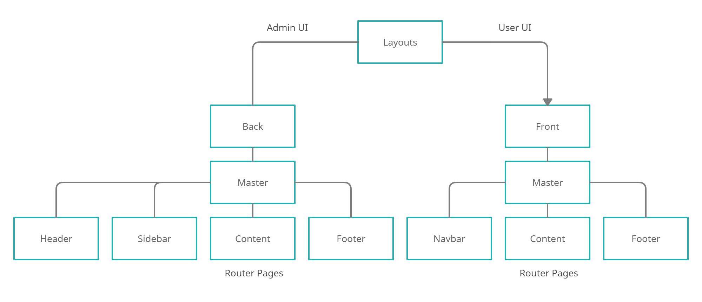

# Human Resources Management System

#### İnsan Kaynakları Yönetim Sistemi, Bu Frontend projesi "React" ile hazırlanmıştır

### UML Component Diagram

***

***

### Kurulum / Installation

- Adım 1 / Step 1

```
git clone https://github.com/YusufAkkurt/hrms-front.git
```

- Adım 2 / Step 2

```
cd hrms-front

npm install
```

- Adım 3 / Step 3

```
npm start
```

Bu uygulamayı geliştirme ortamında çalıştırdıktan sonra\
[http://localhost:3000](http://localhost:3000) linkini web tarayıcısından açıp projeyi görüntüleyebilirsin

### Bağımlılık / Dependency

Bu projeyi düzgün görüntüleyebilmek için Java SpringBoot ile yazılmış Backend projesinin kurulu ve çalışır durumda
olması gerekiyor.

[HRMS Backend with Java SpringBoot](https://github.com/YusufAkkurt/Hrms) bu linke tıklayarak projeye ulaşabilirsiniz.
